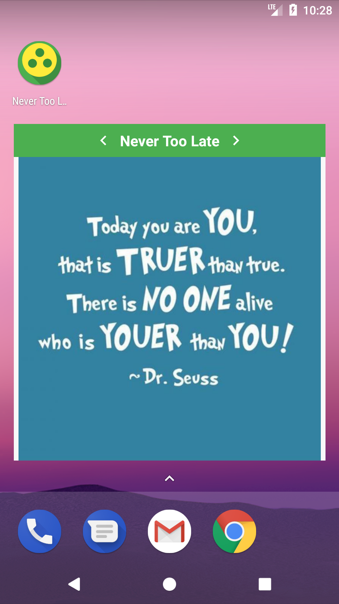

# Never Too Late

It is *Never Too Late* to start all over again!

## Description

> Sometimes during our daily lives, we are just “not feeling it” and we need a few words to motivate ourselves in order to keep on going, right? *Never Too Late* is the application that tries to solve this problem. It can show you meaningful insights whenever you need them: when waking up, when feeling down or even when you simply want some help to stop procrastinating. *Never Too Late* will help *you* make your life better.

## Development

This application was developed as the final project for Udacity's Nanodegree on Android Development.
It is an open-source project and any contributions are welcome!

### Compiling

The only requirement other than the usual Android Studio setup is adding the following information to your `gradle.properties` file:

	GOOGLE_API_KEY=<YOUR_API_KEY>
	REDDIT_ACCOUNT=<YOUR_REDDIT_ACCOUNT>
	REDDIT_KEY=<YOUR_REDDIT_KEY>
	ALIAS_JKS_PASSWORD=
	APK_JKS_PASSWORD=

Both `ALIAS_JKS_PASSWORD` and `APK_JKS_PASSWORD` are only required to have valid values if you wish to generate a signed version of the .apk. Otherwise, you can leave them blank.

### Features

Currently implemented features:

* `Home Screen` for displaying a fixed number of *HOT* (image) entries in the sub-reddit `r/GetMotivated`;
	* The user can: favorite, open *Reddit* and share the motivational image.
* `Favorite Screen` for displaying a list of favorites;
	* The user can: un-favorite, open *Reddit* and share the motivational image.
* `Notifications Screen` allows the user to create 2 types of notifications:
	* Daily notifications: the user choose a time and the app will send a notification with a random entry from the current top *HOT* entries;
	* Location-based notification: the user chooses a location using Google's `PlacePicker` and the app will send the same kind of notification when the user is in a 100m radius of the chosen location.
* Widget that displays the favorite images.

### Roadmap

- [ ] Create both Unit and Instrumentation tests;
- [ ] Infinite scrolling in the Home Screen;
- [ ] Display not only images from r/GetMotivated, but also other kinds of entries;
- [ ] Allow the user to set which days to receive daily notifications;
- [ ] Allow the user to set the radius for receiving location-based notifications;
- [ ] Create other types of notifications;
- [ ] Improve landscape and tablet layouts;
- [ ] Add other sources of motivational images, videos, texts, etc.
- [ ] ...

### Contributing

Please, feel free to make PRs with any kind of contributions, I'd really like that. They are all very welcome! After all, this is and will always be an open source project :)

If you have *any* questions, you can contact me at brunordea@gmail.com.

### Screenshots

<kbd></kbd> <kbd> </kbd> <kbd></kbd> <kbd></kbd>
<kbd></kbd> <kbd></kbd>

# License

Copyright (c) 2018 Bruno Romero de Azevedo (brunordea@gmail.com)

Permission is hereby granted, free of charge, to any person obtaining a copy
of this software and associated documentation files (the "Software"), to deal
in the Software without restriction, including without limitation the rights
to use, copy, modify, merge, publish, distribute, sublicense, and/or sell
copies of the Software, and to permit persons to whom the Software is
furnished to do so, subject to the following conditions:

The above copyright notice and this permission notice shall be included in all
copies or substantial portions of the Software.

THE SOFTWARE IS PROVIDED "AS IS", WITHOUT WARRANTY OF ANY KIND, EXPRESS OR
IMPLIED, INCLUDING BUT NOT LIMITED TO THE WARRANTIES OF MERCHANTABILITY,
FITNESS FOR A PARTICULAR PURPOSE AND NONINFRINGEMENT. IN NO EVENT SHALL THE
AUTHORS OR COPYRIGHT HOLDERS BE LIABLE FOR ANY CLAIM, DAMAGES OR OTHER
LIABILITY, WHETHER IN AN ACTION OF CONTRACT, TORT OR OTHERWISE, ARISING FROM,
OUT OF OR IN CONNECTION WITH THE SOFTWARE OR THE USE OR OTHER DEALINGS IN THE
SOFTWARE.
